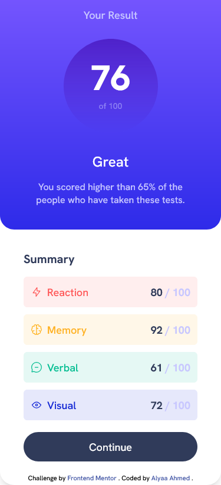

# Frontend Mentor - Results summary component solution

This is a solution to the [Results summary component challenge on Frontend Mentor](https://www.frontendmentor.io/challenges/results-summary-component-CE_K6s0maV). Frontend Mentor challenges help you improve your coding skills by building realistic projects.

## Table of contents

- [Frontend Mentor - Results summary component solution](#frontend-mentor---results-summary-component-solution)
  - [Table of contents](#table-of-contents)
  - [Overview](#overview)
    - [The challenge](#the-challenge)
    - [Screenshot](#screenshot)
    - [Links](#links)
  - [My process](#my-process)
    - [Built with](#built-with)
  - [Author](#author)

## Overview

### The challenge

Users should be able to:

- View the optimal layout for the interface depending on their device's screen size
- See hover and focus states for all interactive elements on the page
<!-- - **Bonus**: Use the local JSON data to dynamically populate the content -->

### Screenshot

<table>
<tr>
<td>
</td>
<td>
</td>
</tr>
</table>

### Links

- Solution URL: [FrontendMentor](https://www.frontendmentor.io/solutions/mobile-first-responsive-solution-using-css-flexbox-and-tailwindcss-xdrO1lDC9m)
- Live Site URL: [Netlify](https://fanciful-hotteok-83eaa2.netlify.app/)

## My process

### Built with

- Semantic HTML5 markup
- Tailwindcss
- Flexbox
- Mobile-first workflow

## Author

- Frontend Mentor - [@AlyaaRushdy](https://www.frontendmentor.io/profile/AlyaaRushdy)
- Linkedin - [Alyaa Ahmed](https://www.linkedin.com/in/alyaa-ahmed/)
